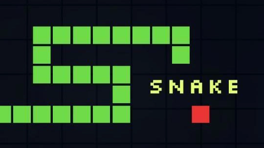

# Switch Plus

Welcome to Switch Plus, a high-fidelity, interactive 3D Nintendo Switch experience right in your browser. Whether you're looking for a quick game of Snake or want to embark on a quest in Pokémon FireRed, Switch Plus has you covered.

 *(Example Game: Snake)*

---

## Getting Started

To start playing, simply open `index.html` in any modern web browser or run it through a local development server for the best experience.

### Basic Controls

The console is fully interactive! You can use your mouse to click the physical 3D buttons or use your keyboard for a more traditional gaming feel.

| Action | Keyboard Key |
| :--- | :--- |
| **Move / D-Pad** | Arrow Keys |
| **Confirm / Button A** | Space or D |
| **Back / Button B** | S or B |
| **Button X** | W |
| **Button Y** | A |
| **Start / Plus** | Enter or P |
| **Select / Minus** | Minus (-) or M |
| **Home Screen** | Escape |

---

## Included Games & Apps

Navigate the home screen carousel to discover what's installed:

*   **Snake**: The classic arcade crawler. Eat dots, grow long, don't hit the walls!
*   **Snake.io**: A competitive twist on the classic Snake formula.
*   **Pong**: Revisit the game that started it all. Can you beat the AI?
*   **Pokémon FireRed**: A full Game Boy Advance experience. Your progress is automatically saved!
*   **Achievements**: Track your milestones and unlock special rewards.
*   **Daily Challenges**: Every day brings a new modifier or goal to test your skills.
*   **System Settings**: Customize your Joy-Con colors (Neon, Slate, etc.) and toggle **Hard Mode** for a greater challenge.

---

## Features

*   **3D Interactive Console**: Rotate and interact with a beautifully rendered 3D Switch model built using Three.js.
*   **Persistent Saves**: Your GBA game saves and achievements are stored locally in your browser, so you can pick up where you left off.
*   **Dynamic UI**: A smooth, authentic OS interface that feels just like the real thing.
*   **Hard Mode**: Feeling like a pro? Enable Hard Mode in settings to crank up the difficulty in all mini-games.

---

## Performance Tips & Shortcuts

*   **Camera Reset**: If you get lost in 3D space, press `Shift + S` to instantly snap the console back to the center.
*   **Development Server**: For the smoothest performance and to ensure save games work correctly, we recommend running with a local server (like `Live Server` in VS Code).

---

*Enjoy your playtime with Switch Plus!*